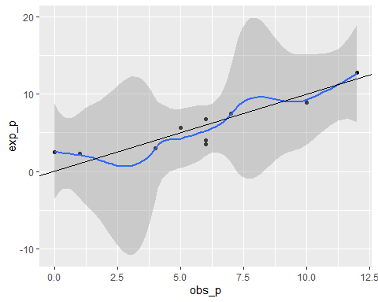
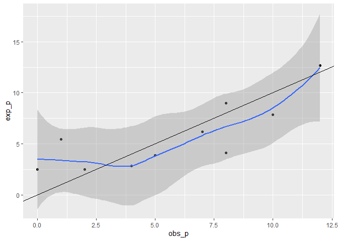

# Descripción de las variables. 


-------------------------------------------------------------------------------------------------------------------------------------------------------
  Modelo          Definicion         Tipo de variable (en modelo)   Nombre de variable (en la base            Unidad               Tipo de variable    
                                                                              de datos)                                                                
----------- ----------------------- ------------------------------ -------------------------------- --------------------------- -----------------------
 $\beta_0$      Presenta dengue              v_respuesta                      enf_dengue                  1 = si; 0 = No          Categorica binomial  

 $\beta_1$           Edad                    v_regresora                         edad                          Anos              Cuantitativa distreta 

 $\beta_2$   Nivel socioeconomico            v_regresora                    nivel_soc_econ           1 = nivel alto; 2 = nivel    Categorica ordinal   
                                                                                                       medio; 3 = nivel bajo                           

 $\beta_3$   Sector en el que vive           v_regresora                     sector_vive                  Sector = 1 o 2          Categorica nominal   
-------------------------------------------------------------------------------------------------------------------------------------------------------

Table: Organizacion de las variables del taller #4

# Respuesta a la preguntas taller # 4

## Problema

En un estudio para investigar la incidencia de dengue en una determinada ciudad
de la costa mexicana, un total de 196 individuos, escogidos aleatoriamente en dos
de los sectores de la ciudad, respondió a las siguientes preguntas: (i) (edad) Edad
(en a~nos), (ii) (nivel) nivel socioeconómico (1 nivel alto/ 2 nivel medio/ 3 nivel
bajo), (iii) (sector) sector en el que vive y (iv) (enfermedad) si el entrevistado
contrajo o no la enfermedad recientemente (1 si/ 0 no).

### Pregunta #1: Considere un modelo logístico lineal para explicar la probabilidad de que un individuo contraiga la enfermedad a partir de las tres variables explicativas. Describa las componentes aleatoria y sistemática del modelo propuesto.

* Componentes aleatoria: corresponde a la variable respuesta `enf_dengue`. Como está descrito en la tabla 1. Es una variables categórica dicotómica o binomia, que puede tomar el valor 1 cuando el caso tiene la enfermedad del dengue o valor 0 cuando no la tiene. 
* Compoenentes sistemática: corresponde a las tres variables regresoras `edad`, `nivel_soc_econ`, `sec_vive`. Las especificaciones acerca de la unidad de medida y el tipo de variable está descrito en la tabla 1. 
* Función enlace o función $logit$: $\ln \frac{\pi}{\pi - 1}$


Table: Estimadores, $z-values$, $p-values$ de la regresión logística

                           Estimado   ErrorStand   $z-value$   $p-value$
------------------------  ---------  -----------  ----------  ----------
(Intercept)                 -2.2939       0.4368     -5.2521      0.0000
edad                         0.0270       0.0087      3.1114      0.0019
factor(nivel_soc_econ)2      0.0446       0.4325      0.1031      0.9178
factor(nivel_soc_econ)3      0.2534       0.4055      0.6249      0.5320
factor(sector_vive)2         1.2436       0.3523      3.5303      0.0004

La tabla 2. muestra los estimadores obtenidos por el modelo logistico aplicado. Allí se puede observar que tan solo las variables regresoras `edad`y `sector_vive`son significativas ($p - value < 0.05$) y por lo tanto son suceptibles de interpretación. El nivel socio económico en niguno de sus niveles (1, 2, o 3) tienen significancia. 


```
## fitting null model for pseudo-r2
```


Table: Tests de bondad de ajuste del modelo: 
 Pseudo $R^2$ de McFadden (ps-$R^2$) & 
      Test de Hosmer-Lemeshow ($ji^2$ HL)

 ps-$R^2$    $ji^2$ HL    G.libertad ($ji^2$ HL)    $p-value(ji^2 HL)$ 
----------  -----------  ------------------------  --------------------
  0.1062      8.0633                8                     0.4273       

Para evaluar la bondad del modelo aplicado ser realizó dos pruebas de bodad de ajuste (tabla 3). En primer lugar, se llevo acabo un pseudo-$R^2$ de McFadden con un resultado de 0.106 si este valor rodea 0.2 a 0.4 quiere decir buen ajuste[^1]. Según lo anterior el estadístico de McFadden no muestra buen ajuste del modelo. 

En la misma tabla 3. se encuentra el resultado del test de Hosmer-Lemeshow, es cual establece que $H_0 = $ buen ajuste del modelo y $H_1 =$ modelo no tiene buen ajuste. Este ajuste se da através de las diferencias entre los valores observados y los valores esperados predichos por el modelo, entonces $H_0 = $ indica que no hay diferencias significativas entre los valores observados y los esperados y $H_1 =$ que existen diferencias significativas. 




Como se puede observar en la tabla 3. El test de Hosmer-Lemeshow no es significativo ($p - value = 0.4273, \geq 0.05$). De manera que no se puede rechazar la hipotesis nula y se puede concluir que el modelo tiene buen ajuste. La figura 1. muestra la relación entre los valores observados y esperados por el modelo. La curva azul es la curva de correlación y la negra corresponde a una correlación exacta. De esto se puede concluir que la relación entre las diferencias de los valores observados y esperados giran entorno la linea de referencia por lo tanto sus defencias no son muy grandes.


Table: Comparación Deviance NULL vs Deviance del modelo LOGIT

 Deviance_NULL (DN)    G.libertad DN    Deviance_modelo (DM)    G.libertad(DM) 
--------------------  ---------------  ----------------------  ----------------
      236.3293              195                211.22                191       

Finalmente se realizó un análisis de *Deviance* los cuales servir como indicadores de *maldad* y ajuste del modelo. En la tabla 4 se muestra el valor del *deviance* en un modelo sin variables regresoras (NULL) con un resultado de 263.33 y el valor del *deviance* en el modelo logístico resultado para las variables dadas con un resultado de 211.22. En este caso se asume que si el *deviance* del modelo es menor que el *deviance* NULL, el modelo tiene mejor ajuste, lo que es verdadero para este caso. 


Table: Exponencial razón de odds $e^{coeff}$

                           $e^{coeff} = \pi$    $(\pi-1)\times100 (\%)$ 
------------------------  -------------------  -------------------------
(Intercept)                     0.1009                  89.9131         
edad                            1.0274                  2.7359          
factor(nivel_soc_econ)2         1.0456                  4.5619          
factor(nivel_soc_econ)3         1.2884                  28.8441         
factor(sector_vive)2            3.4682                 246.8181         


### Pregunta #2: La probabilidad de que un individuo contraiga la enfermedad depende de su edad?
El análisis de los estimadores los $z-value$ y sus correspondientes $p-values$ evidenciados en la tabla 2, se podría afirmar que la variable `edad` si puede afectar el $\beta_0$ (tener la enfermedad dengue o la variable respuesta `enf_dengue`). En este caso se podría afirmar que por cada incremento en una unidad de `edad` el chance de tener Dengue incrementa en un 2.73% como se puede ver en la tabla 5. 


### Pregunta #3: La probabilidad de que un individuo contraiga la enfermedad depende del sector de la ciudad en el que vive?

En este caso a través de los resultados mostrados en la tabla 2, se podría afirmar que la variable `sector_vive` si puede afectar el $\beta_0$ (tener la enfermedad dengue o la variable respuesta `enf_dengue`). En este caso se podría afirmar que el vivir en el sector 2 incrementa el 243% el chance de tener Dengue respecto a vivir en el sector 1 como se puede ver en los resultados de la tabla 5. 

### Pregunta #4: Según el modelo estimado, cuál es la probabilidad de contraer dengue de una persona de 30 añoos, nivel socioeconómico alto y que vive en el sector 2 de la ciudad?


```r
predict(denguelogit, data.frame(sector_vive=2, nivel_soc_econ=1,edad=30), type="response")
```

Para dar respuesta a la pregunta 4 como se puede ver se hizo uso de la función `predict`. Definiendo los paramétros solicitados, se obtiene que, a traés del modelo *logit* realizado la probabilidad de contraer la enfermedad por Dengue en una persona de 30 años que viva en el sector 2 y que sea de nivel socioeconómico alto es del 44%. 

### Pregunta #5: Seleccione el "mejor" modelo para describir el fenómeno bajo estudio. Use como guía la medida de calidad del ajuste AIC. Verifíque que todas las variables en el modelo elegido sean estadísticamente signifícativas. INTERPRETE los parámetros del modelo escogido.


```r
step(object = Full_denguelogit, direction = "both", trace = FALSE)
```

Para realizar la selección del mejor modelo se utilizo una estrategía *stepwise* bidireccional [^2] (forward y reverse), a través de la función `step`. Su resultado permitió establecer como "mejor modelo" (como se designara en adelante), de únicamente dos variables regresoras `edad` y `sec_vive`, excluyendo la variables no siginificativas en el modelo original `nivel_soc_econ` 2 y 3. Como se puede observar en la tabla 6 el AIC del mejor modelo es menor que el AIC el modelo original, lo que corrobora al primero como "mejor", para las variables dadas. De esta forma, los análisis a continuación se realizarán con este "mejor modelo" de dos variables regresoras. 


Table: Comparación de valor AIC del modelo original y el mejor modelo obtenido por el estadítico

 AIC_modelo_original    AIC_mejor_modelo 
---------------------  ------------------
       221.22               217.6393     

La tabla 7, muestra los estimadores del mejor modelo con sus respectivos $z-value$ y $p-value$ como se puede observar en este caso todas las variables son significativas estadísticamente ($p-value < 0.05$). 


Table: Estimadores, $z-values$, $p-values$ de la regresión logística

                        Estimado   ErrorStand   $z-value$      $p-value$
---------------------  ---------  -----------  ----------  -------------
(Intercept)              -2.1597       0.3439     -6.2802   3.381506e-10
edad                      0.0268       0.0086      3.0998   1.936226e-03
factor(sector_vive)2      1.1817       0.3370      3.5070   4.532196e-04


```
## fitting null model for pseudo-r2
```


Table: Tests de bondad de ajuste del mejor modelo: 
             
 Pseudo $R^2$ de McFadden (ps-$R^2$) & Test de Hosmer-Lemeshow ($ji^2$ HL)

 ps-$R^2$    $ji^2$ HL    G.libertad ($ji^2$ HL)    $p-value(ji^2 HL)$ 
----------  -----------  ------------------------  --------------------
  0.1045      14.9561               8                      0.06        





Table: Comparación Deviance NULL vs Deviance del mejor modelo LOGIT

 Deviance_NULL (DN)    G.libertad DN    Deviance_modelo (DM)    G.libertad(DM) 
--------------------  ---------------  ----------------------  ----------------
      236.3293              195               211.6393               193       

### Pregunta #6: Describa el desempeño del modelo seleccionado usando su matriz de confusión.


```
## [1] 0.744898
```

[^1]:Domencich & McFadden (1975) Urban Travel Demand: A Behavioral Analysis, Elsevier. 
[^2]:Se intentó un *stepwise* unidireccional *forward* como se encontraba en el script facilitado por el profesor, pero se encontró que bajo esta estrategía el resultado era el mismo que el modelo original, con la variable `nivel_soc_econ`no significativa. Al utiliza el método bidireccional se garantizó que todas las variables fueran estadísticamente significativas. 
